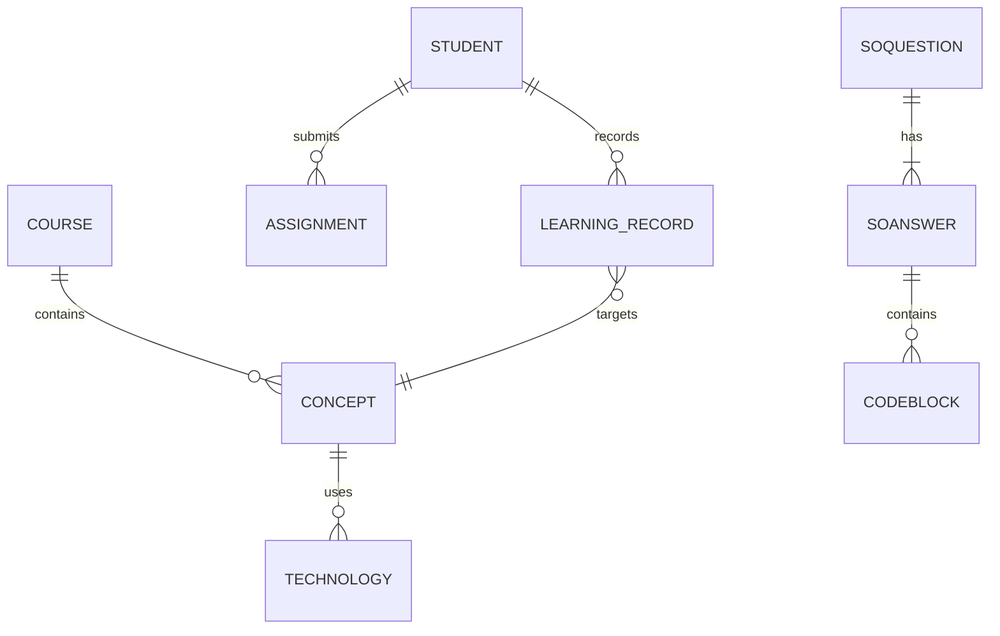

# System Architecture

This document summarizes the overall architecture of the AI-driven education platform described in the repository.

## Architecture Overview

```mermaid
graph TD
    A[External Data Sources\nGitHub, Stack Overflow, Wikipedia] --> B[Data Ingestion Scripts]
    B --> C[Neo4j Knowledge Graph]
    C -->|Context/Concepts| G[Generative AI Service]
    G --> D[Backend API (FastAPI)]
    D --> E[Frontend (React)]
    E --> F[Students/Teachers]
    F -->|Actions| D
    D --> H[Adaptive Engine]
    H --> C
```

The system gathers programming knowledge from public sources through crawler scripts. This data is stored as entities and relationships in Neo4j. The backend exposes APIs that combine knowledge graph queries with Large Language Model calls. The frontend allows students and teachers to browse concepts, mark progress and obtain AI-generated help. An adaptive engine analyses learning records and interacts with the graph to recommend personalised exercises.

## Entity Relationship Diagram



This ER diagram illustrates the key nodes managed in the knowledge graph. Students create assignments and accumulate learning records linked to specific concepts. Each course consists of multiple concepts which in turn relate to various technologies. The system also connects questions, answers and code examples imported from Stack Overflow.
