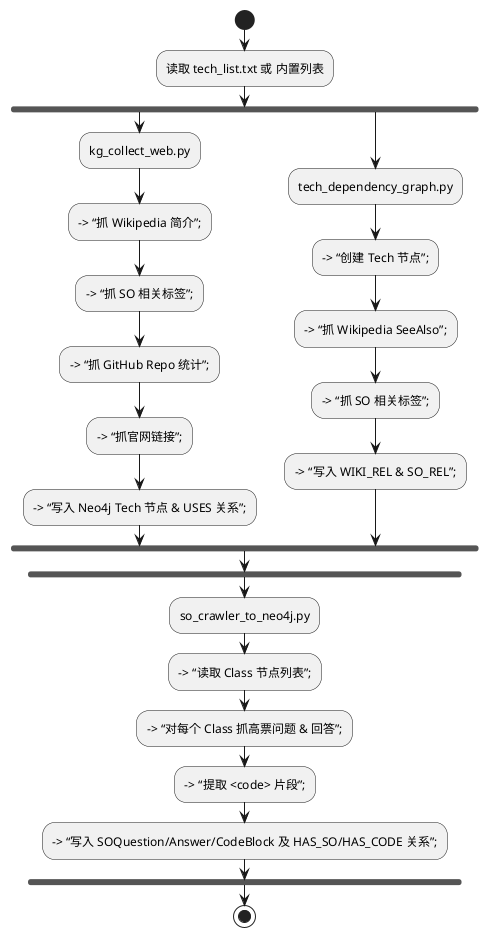

在论文里，你可以专门开一个小节（例如 “2.3 数据采集与图谱构建脚本”），先用一个**表格**概括所有脚本的核心信息，然后配一张**流程图**或**活动图**，把它们串联成一个端到端的数据采集——预处理——写入 Neo4j 的管道。下面给你一个示例结构：

---

### 2.3 数据采集与图谱构建脚本

#### 2.3.1 脚本概览表

| 脚本名                            | 功能                                                                              | 输入                     | 输出                                           | 依赖模块                                                           |
| ------------------------------ | ------------------------------------------------------------------------------- | ---------------------- | -------------------------------------------- | -------------------------------------------------------------- |
| **kg\_collect\_web.py**        | 在线抓取技术属性并写入 Neo4j                                                               | `tech_list.txt`（技术名列表） | Neo4j 中的 `Tech` 节点与 `USES` 关系                | `neo4j`、`requests`、`beautifulsoup4`、`wikipedia-api`、`PyGithub` |
| **tech\_dependency\_graph.py** | 基于 Wikipedia “See also” & SO 标签构建技术依赖图                                          | 内嵌 `TECH_LIST`         | Neo4j 中的 `Tech` 节点与 `WIKI_REL` / `SO_REL` 关系 | 同上（无 GitHub）                                                   |
| **so\_crawler\_to\_neo4j.py**  | 从 StackOverflow 抓取 Q\&A 和代码片段，写入 `Class`, `SOQuestion`, `SOAnswer`, `CodeBlock` | Neo4j 中已有的 `Class` 节点  | Neo4j 中新增 SOQuestion/Answer/CodeBlock 节点及关系  | `neo4j`、`requests`、`beautifulsoup4`                            |

#### 2.3.2 脚本执行流程（活动图）

图 2-3 展示了三类脚本如何并行／串行协作，将不同来源的数据采集、清洗后，统一写入知识图谱。

#### 2.3.3 文本说明（示例）

> **kg\_collect\_web.py**
> 该脚本首先从 `tech_list.txt`（或内置技术列表）中读取待补全的技术名称，依次通过 Wikipedia API、Stack Overflow API、GitHub API 和 DuckDuckGo 搜索抓取每个技术的简介、相关标签、Star/Fork 统计、官网链接等属性；然后使用 Neo4j Python 驱动，将这些属性以 `Tech` 节点和 `USES` 边的形式写入知识图谱，并与核心框架节点（如 Spring Boot）建立依赖关系。
>
> **tech\_dependency\_graph.py**
> 本脚本面向技术依赖网络构建，利用 Wikipedia “See also” 列表和 SO 相关标签，仅当抓到的关联技术也在预定义列表中时才写入 Neo4j，通过 `WIKI_REL` 和 `SO_REL` 边构建更细粒度的技术依赖图谱。
>
> **so\_crawler\_to\_neo4j.py**
> 该脚本针对 `Class` 节点（Spring Boot 中的 Java 类）做深度挖掘，从 StackOverflow 查询该类的高票已采纳回答，提取回答正文中的 `<pre><code>` 代码块，生成 `SOQuestion`、`SOAnswer`、`CodeBlock` 节点，并将它们通过 `HAS_SO`、`HAS_ANSWER`、`HAS_CODE` 关系连入图谱，实现“教程+真实问答+示例代码”三元融合。

---

这样既有**表格**让读者一目了然，又用**活动图**展示三个脚本的协同流程，最后再配上一段**精炼文字说明**，你就完整、清晰地介绍了整个脚本工具链在系统中的作用。
